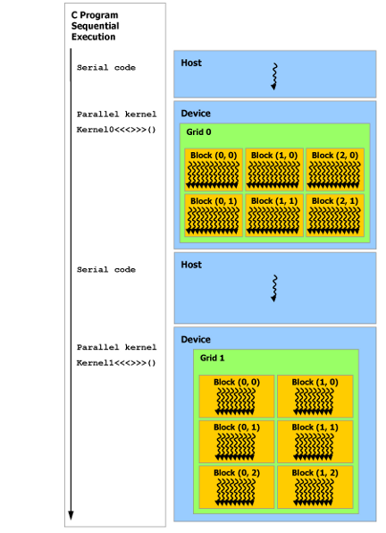

# 100 Days of CUDA - Day 5 - Memory Hierarchy

Each thread has private local memory. 

Each thread block has shared memory block visible to all threads of the block and with the same lifetime as the block.

Thread blocks in a thread block cluster can perform read, write, and atomics operations on each others' shared memory.

All threads have access to the same global memory.

There are two additional read-only memory spaces accessible by all threads,
1. The constant memory space
2. texture memory space

## Heterogeneous Programming
CUDA program assumes two types of memory, Host memory and device memory. CUDA runtime manages device memory allocation, deallocation as well as data transfer between host and device.

Unified memory provides managed memory to bridge the host and device memory spaces. Managed memory is accessible from all CPUs and GPUs in the system as a single, coherent memory image with a common address space.

## Asynchronous SIM Programming Model
An asynchronous operation is defined as an operation that is initiated by a CUDA thread and is executed asynchronously as-if by another thread. In a well formed program one or more CUDA threads synchronize with the asynchronous operation. The CUDA thread that initiated the asynchronous operation is not required to be among the synchronizing threads.